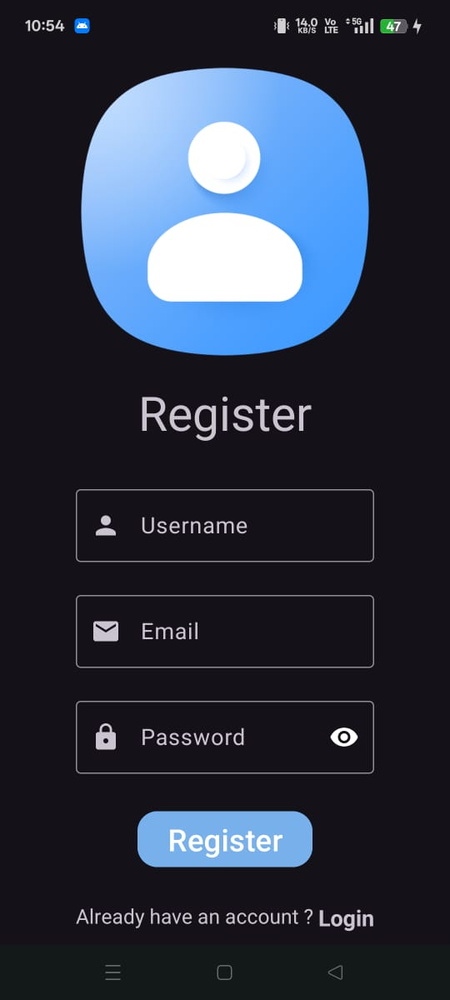
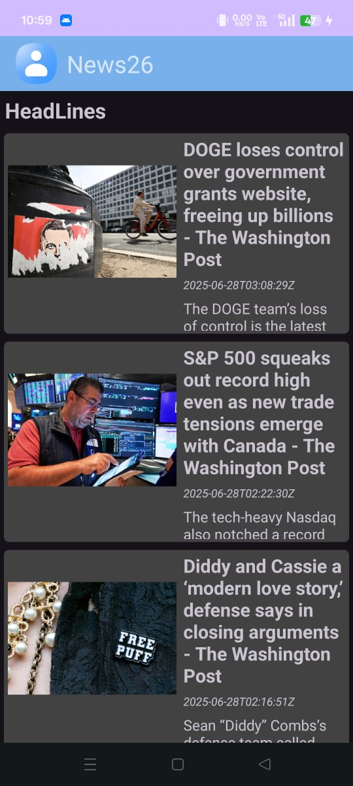
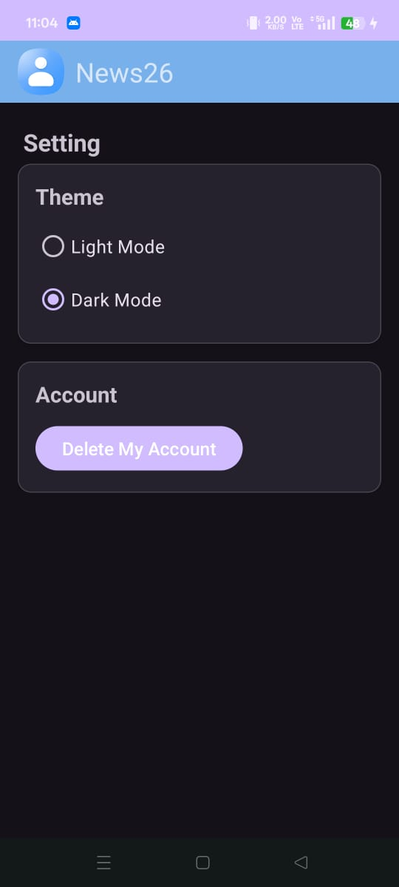
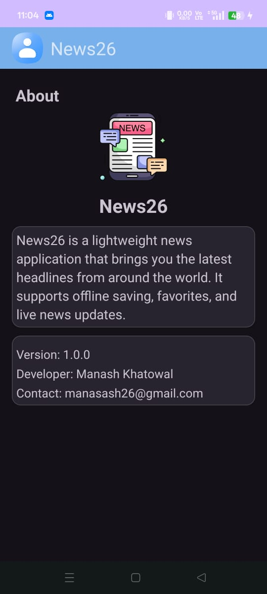

# 📰 News26 - Android News App

**News26** is a sleek and modern Android news application built using Kotlin, Jetpack libraries (Compose/Fragments), and Firebase. It delivers the latest news headlines, allows users to save favorites, read full articles in a WebView, and supports light/dark themes with user authentication.

## ✨ Features

- 🔐 Firebase Authentication (Login/Register)
- 🗞️ Live news headlines from REST API
- ❤️ Save articles to favorites (Room DB)
- 🌐 In-app WebView for full articles
- 🌓 Light & Dark mode toggle
- 🧹 Delete Firebase account
- 🔌 Network-aware: auto refresh when internet reconnects
- ✅ Beautiful Material Design UI

---

## 📸 Screenshots

| Login/Register | Headlines | Article Detail |
|----------------|-----------|----------------|
|  |  |  |

| Favorites | Settings | About |
|-----------|----------|-------------|
|  |  |  |

| No Internet | Navigation |
|-------------|------------|
|  |  | 

---

## 🛠️ Tech Stack

- **Language:** Kotlin
- **Architecture:** MVVM
- **UI:** ViewBinding + Fragments + Material Components
- **Firebase:** Auth + Firestore
- **Network:** Retrofit + Coroutine
- **Persistence:** Room
- **Others:** Glide, Snackbar, LiveData, ViewModel

---

## 🔧 Setup Instructions

1. **Clone this repo**:
   ```bash
   git clone https://github.com/Manash396/News26.git
